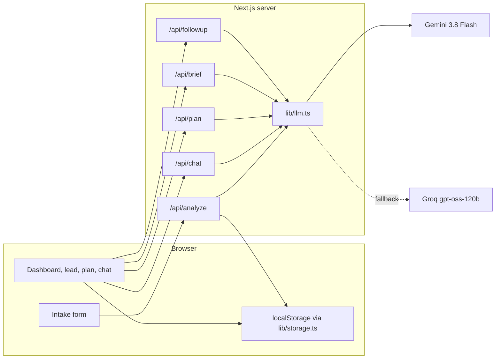

# LeadLens

LeadLens helps a real-estate salesperson decide which inbound lead to work, what the customer actually wants, and what to do next. It is a small Next.js app. Leads live in the browser. Gemini runs only on the server.

The six leads on the dashboard are demo data, so a reviewer sees a full inbox with no API key. **New lead, Re-analyze, chat, Today's plan, the call brief, and Draft follow-up** call the model.

## What I built

- **Intake.** Name, location, property requirement, budget, timeline, and a free-text customer message. Zod shows inline errors. "Load sample lead" fills a Noida inquiry for a live demo.
- **Analysis.** `/api/analyze` returns a summary, intent, requirements, objections, one next action, a WhatsApp-ready reply, a 0–100 score, hot/warm/cold, an urgency flag, and one or two reasons for the score.
- **Grounded chat.** Each lead has a chat panel. The server puts that lead's record, analysis, notes, and history into the prompt. Quick chips cover call prep, a more assertive reply, a shorter reply, Hinglish, and a price objection. Rewritten messages have a Copy button.
- **Prioritized inbox.** Cards sort by score by default. Filters: All / Hot / Warm / Cold. Sorts: score, newest, follow-up due. A lead opens into the full analysis.
- **Today's plan, call brief, and follow-up** (my feature). See below.

### My feature: before, during, and after the call

| Moment | What the salesperson gets |
| --- | --- |
| Before | **Today's plan** (`/plan`). A rule-based queue is visible immediately (overdue first, then score). "Generate AI plan" asks the model for a reason, a time window, and a channel (call / WhatsApp / email) per open lead. |
| During | **30-second brief** on the lead: an opener, three talking points, objections with rebuttals, and the ask. |
| After | A status pipeline (New → Contacted → Site Visit → Negotiation → Won/Lost), **Log contact** (channel, notes, follow-up date), an overdue badge, and **Draft follow-up** for WhatsApp, email, or SMS. The draft is editable, then copied. |

New leads get a follow-up date from the timeline (sooner if the model marks them urgent). Logging a contact moves `New` to `Contacted` and resets that date.

## Architecture



The browser never sees `GEMINI_API_KEY`. It sends the lead JSON to an API route. The route validates with Zod, builds a prompt from `lib/prompts.ts`, and calls `generateStructured` in `lib/llm.ts`.

```
app/
  (pages)/              dashboard, /new, /plan, /leads/[id]
  api/analyze|chat|plan|brief|followup/route.ts
components/             UI only. No model calls except through fetch.
lib/
  types.ts              the nouns: Lead, Analysis, chat, plan
  schemas.ts            Zod for the form, stored leads, and API payloads
  gemini-schemas.ts     Gemini responseSchema objects (server only)
  prompts.ts            every prompt, and why it is written that way
  llm.ts                Gemini, one retry, then Groq
  guard.ts              body size, JSON parse, in-memory rate limit
  storage.ts            getLeads, saveLead, updateLead, deleteLead
  seed.ts               six demo leads
  leads.ts              score bands, overdue, sort, rule-based queue
```

## How the model is called

Default model: **gemini-3.8-flash**. SDK: `@google/genai`. The brief named `gemini-2.0-flash` or `gemini-2.5-flash`. Google now returns “no longer available” for new API keys on those models and tells the caller to use `gemini-3.8-flash`. Set `GEMINI_MODEL` if you need a different id.

1. `generateContent` with `responseMimeType: "application/json"` and a `responseSchema`, plus a system prompt.
2. The text is parsed as JSON. A few safe coercions run first (round the score, lowercase `hot`/`warm`/`cold`). Zod then checks the shape.
3. If Gemini errors, times out (22s), or fails Zod, **it is retried once**.
4. If that still fails and `GROQ_API_KEY` is set, **one** Groq call runs (`openai/gpt-oss-120b` by default, override with `GROQ_MODEL`, `response_format: json_object`). The brief named `llama-3.3-70b-versatile`; Groq no longer serves that model. Groq does not accept Gemini's schema, so the same system prompt tells it to return one JSON object.
5. On `/api/analyze`, the server then sets priority from the score: **75–100 hot, 45–74 warm, 0–44 cold**. The prompt uses the same bands. The badge cannot drift from the number.

Other guards:

- Customer message max **4000** characters. Chat questions max **2000**. Request body max ~120 KB.
- **20 requests / minute / IP** in memory. On Vercel each instance has its own counter, so this is a best-effort guard. The length cap is the hard one.
- The customer message is wrapped in `<<<CUSTOMER_MESSAGE>>>` … `<<<END CUSTOMER_MESSAGE>>>`. Fence characters typed by the customer are stripped so they cannot close the block. The prompt says that block is data, not instructions.
- API keys are read from `process.env` inside `lib/llm.ts` only.

## How the score is calculated

The model starts at 0 and adds:

| Piece | Points |
| --- | --- |
| Budget clarity and realism | 0–25 |
| Timeline urgency | 0–25 |
| Specificity of requirements | 0–20 |
| Engagement in the message | 0–20 |
| Red flags | subtract 0–20, floor at 0 |

`scoreReasoning` is one or two bullets so the salesperson can see why. The raw customer message stays on the lead page so they can check the model did not invent a fact. Missing facts should be written as **not mentioned**.

Demo scores (handwritten, not from the API): Priya 86 hot, Rahul 81 hot, Ananya 64 warm, Vikram 52 warm, Sneha 26 cold, Arjun 22 cold.

## Run locally

Requirements: Node.js 20+.

```bash
npm install
cp .env.example .env.local
```

Put a free Gemini key in `.env.local` ([Google AI Studio](https://aistudio.google.com/apikey)):

```bash
GEMINI_API_KEY=your_key_here
```

Optional fallback:

```bash
GROQ_API_KEY=your_groq_key_here
```

```bash
npm run dev
```

Open [http://localhost:3000](http://localhost:3000). The inbox is already filled. Restart the dev server after changing `.env.local`.

## Deploy on Vercel (free tier)

1. Push this repo to GitHub.
2. In Vercel: **Add New Project** → import the repo. Framework preset: **Next.js**.
3. Build command: `npm run build`. Install command: `npm install`. Output: Next.js default. No extra config file.
4. Environment variables:
   - `GEMINI_API_KEY` (required for live AI)
   - `GROQ_API_KEY` (optional)
   - `GEMINI_MODEL` (optional, default `gemini-3.8-flash`)
5. Deploy. Add or change env vars, then redeploy so the server picks them up.

The demo leads are created in each visitor's browser, so the live URL works before anyone pastes a key. Live analysis needs the Gemini variable.

## Key decisions

- **Gemini, server-side.** The free tier is enough for a demo, and `responseSchema` makes the JSON much more reliable than "please return JSON" alone. The key stays off the client because anyone can open the site.
- **Groq as a fallback, not a second product path.** One wrapper (`lib/llm.ts`) keeps the routes identical if Gemini is rate-limited.
- **localStorage behind four functions.** The assignment needs multiple saved leads and no paid database. `getLeads` / `saveLead` / `updateLead` / `deleteLead` are the seam. A Supabase version would keep those names and move them server-side. The UI would not change shape. `useSyncExternalStore` is how React reads a browser store without a hydration mismatch.
- **Structured JSON plus Zod.** The UI is a fixed set of cards. If the model rambles, we retry once instead of rendering a paragraph into the score ring.
- **Chat is grounded because the prompt contains this lead.** A generic chatbot would tell every salesperson to "build rapport". Here the question is answered from that customer's budget, timeline, objections, and notes.
- **Rules for order, model for language.** Sort, overdue, and the queue you see before clicking "Generate AI plan" do not need a model. They still work when the API is down. The model writes the reason, the slot, and the words.
- **Seed analyses are labeled "Demo analysis".** I did not want a reviewer to think those six cards were live model output. Re-analyze is the live call.

## Known limitations

- **localStorage is per browser.** Nothing is shared across teammates or devices. Clearing site data deletes the pipeline.
- **No auth.** Anyone with the URL uses their own empty-then-seeded inbox.
- **Free-tier rate limits and timeouts.** Gemini and Groq both throttle. The UI shows the error string from the server (rate limit, missing key, timeout). There is no queue or background job.
- **The in-memory rate limit does not span all Vercel instances.**
- **No CRM, no real send.** Copy puts text on the clipboard. The app does not send WhatsApp, email, or SMS.
- **The model can still be wrong.** The rubric and "not mentioned" rule reduce invented facts. They do not remove them. The customer message is on the page so the salesperson can check.
- **Seed data is not a live analysis.** Dates are computed on first load so "overdue" stays meaningful, but the paragraphs were written by hand.

## Future improvements

- Swap `lib/storage.ts` for Supabase (or any Postgres) and add a salesperson login.
- Push a real WhatsApp message via the official Cloud API instead of Copy.
- Store the last plan for the day so a refresh does not require another model call.
- Calibrate the rubric against deals the team actually won, instead of only the prompt.

## Scripts

```bash
npm run dev
npm run lint
npm run build
npm start
```
