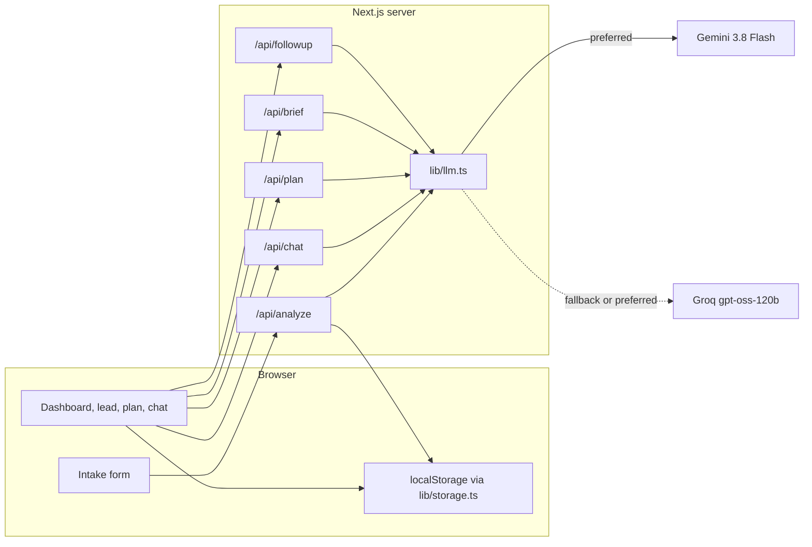

# LeadLens

LeadLens helps a real-estate salesperson decide which inbound lead to work, what the customer actually wants, and what to do next. It is a small Next.js app. Leads live in the browser. Gemini runs only on the server.

The six leads on the dashboard are demo data, so a reviewer sees a full inbox with no API key. **New lead, Re-analyze, chat, Today's plan, the call brief, and Draft follow-up** call the model.

## What I built

- **Intake.** Name, location, property requirement, budget, timeline, and a free-text customer message. Zod shows inline errors. "Load sample lead" fills a Noida inquiry for a live demo.
- **Analysis.** `/api/analyze` returns a summary, intent, requirements, objections, one next action, a WhatsApp-ready reply, a 0–100 score, hot/warm/cold, an urgency flag, and one or two reasons for the score.
- **Grounded chat.** Each lead has a chat panel. The server puts that lead's record, analysis, notes, and history into the prompt. Quick chips cover call prep, a more assertive reply, a shorter reply, Hinglish, and a price objection. Rewritten messages have a Copy button.
- **Prioritized inbox.** Cards sort by score by default. Filters: All / Hot / Warm / Cold, plus a stage filter. Sorts: score, newest, follow-up due. A search box matches name, city, phone digits, requirement, budget, and the AI summary; every word must match, so "noida 3 bhk" narrows the list. Open leads nobody has touched in 5+ days get an "Nd silent" badge. A lead opens into the full analysis.
- **Insights page** (`/insights`). Open leads, open pipeline value (sum of the budgets `parseBudgetInr` can read), win rate, overdue follow-ups, median time to first contact, leads per stage with the average score, priority mix, top cities (Gurgaon and Gurugram count as one), and a "going cold" list. Plain arithmetic in `lib/insights.ts`, so it works with no AI quota.
- **CSV export.** Downloads the leads currently shown on the inbox, with a parsed "Budget (INR)" column. Cells that start with `=`, `+`, `-`, or `@` are prefixed with `'` so a spreadsheet does not run them as formulas.
- **Duplicate warning.** While you type a new lead, the form warns if the phone number (in any format) or the same name in the same city is already in the inbox, and links to it. The button changes to "Analyze anyway", so you are not blocked.
- **Pipeline board** (`/pipeline`). One column per stage with a lead count and the sum of budgets. Drag a card to another column to change its stage. Each card also has a "Move to" menu, because drag and drop does not work with a keyboard or on most phones.
- **Follow-up agenda and calendar export.** The plan page lists every open follow-up under Overdue / Today / Tomorrow / Next 7 days / Later. "Add to calendar (.ics)" downloads one 30-minute event per follow-up with a 15-minute reminder, for Google Calendar, Outlook, or Apple Calendar. Each event keeps the lead id as its UID, so importing again updates events instead of duplicating them. Overdue follow-ups are placed 30 minutes from now, not in the past.
- **Backup and restore.** "Back up" saves every lead, note, and chat to a JSON file. "Restore" merges a backup by lead id: the copy edited most recently wins, so an old file never overwrites newer notes. Unreadable rows are skipped one by one and counted, and you confirm before anything changes.
- **Works on phones and tablets.** Below 1024px the page links move to a bottom tab bar, padded for the iPhone home indicator and the Android gesture bar. The pipeline becomes swipeable columns. On touch screens every button and select is at least 44px tall, and fields use 16px text so iOS Safari does not zoom in on focus. "Add to Home Screen" on iOS and "Install app" on Android open LeadLens full screen with its own icon (`app/manifest.ts`, `app/icon.tsx`, `app/apple-icon.tsx`).
- **Provider switch.** Auto / Gemini / Groq in the header, with a status dot per provider. See "How the model is called".
- **Today's plan, call brief, and follow-up** (my feature). See below.

### My feature: before, during, and after the call

| Moment | What the salesperson gets |
| --- | --- |
| Before | **Today's plan** (`/plan`). A rule-based queue is visible immediately (overdue first, then score). "Generate AI plan" asks the model for a reason, a time window, and a channel (call / WhatsApp / email) per open lead. |
| During | **30-second brief** on the lead: an opener, three talking points, objections with rebuttals, and the ask. |
| After | A status pipeline (New → Contacted → Site Visit → Negotiation → Won/Lost), **Log contact** (channel, notes, follow-up date), an overdue badge, and **Draft follow-up** for WhatsApp, email, or SMS. The draft is editable, then copied. |

New leads get a follow-up date from the timeline (sooner if the model marks them urgent). Logging a contact moves `New` to `Contacted` and resets that date.

## Architecture



The browser never sees `GEMINI_API_KEY`. It sends the lead JSON to an API route. The route validates with Zod, builds a prompt from `lib/prompts.ts`, and calls `generateStructured` in `lib/llm.ts`.

```
app/
  (pages)/              dashboard, /new, /plan, /leads/[id]
  api/analyze|chat|plan|brief|followup|match|pitch|logcall/route.ts
components/             UI only. No model calls except through fetch.
lib/
  types.ts              the nouns: Lead, Analysis, chat, plan
  schemas.ts            Zod for the form, stored leads, and API payloads
  gemini-schemas.ts     Gemini responseSchema objects (server only)
  prompts.ts            every prompt, and why it is written that way
  llm.ts                provider order, cooldowns, shared schema, repair + retry
  guard.ts              body size, JSON parse, in-memory rate limit
  storage.ts            getLeads, saveLead, updateLead, deleteLead
  seed.ts               six demo leads
  leads.ts              factor sum, score bands, overdue, sort, rule-based queue
  insights.ts           pipeline numbers, search, duplicate check, CSV export
  calendar.ts           follow-up agenda buckets and the .ics export
  backup.ts             backup file format, validation, merge by newest edit
  download.ts           save text as a file in the browser
  phone.ts              normalizePhone for wa.me
  inventory.ts          12 homes and the city/budget shortlist
```

## How the model is called

Default model: **gemini-3.8-flash**. SDK: `@google/genai`. The brief named `gemini-2.0-flash` or `gemini-2.5-flash`. Google now returns “no longer available” for new API keys on those models and tells the caller to use `gemini-3.8-flash`. Set `GEMINI_MODEL` if you need a different id.

1. **Provider order.** The switch in the header picks who answers first: **Auto** or **Gemini** (Gemini, then Groq) or **Groq** (Groq, then Gemini). The browser sends the choice as an `x-llm-provider` header. `GET /api/providers` reports which keys are set and which provider is cooling down (it never returns a key).
2. **Same schema for both.** Gemini gets `responseMimeType: "application/json"` plus a `responseSchema`. Groq gets that same schema converted to strict `json_schema` mode, so it can no longer return `body` instead of `message` or a string where `{ points, reason }` belongs. If a Groq model rejects `json_schema`, the call falls back to `json_object` automatically.
3. **Parse, coerce, repair, validate.** JSON is pulled out of fences or stray prose. Safe coercions run (round the score, lowercase `hot`/`warm`/`cold`). If Zod reports an array that is too long, a string that is too long, or points out of range, those are trimmed or clamped and checked again.
4. **Retry with feedback.** If Zod still fails, the retry tells the model which fields were wrong. The first provider gets two tries, the fallback one.
5. **Cooldown on rate limits.** A 429 is not retried on the same provider. That provider is skipped until the `retry in Ns` time Google or Groq sends (60s if none), then tried again. The error message lists every provider that was tried.
6. On `/api/analyze`, the model returns five factor scores and does not return a total. `finalizeAnalysis` sums them, clamps the total to 0–100, and sets priority: **70–100 hot, 40–69 warm, under 40 cold**. A `hardOverride` replaces only the badge (spam or an explicit do-not-contact), not the number.

Other guards:

- Customer message max **4000** characters. Chat questions max **2000**. Request body max ~120 KB.
- **20 requests / minute / IP** in memory. On Vercel each instance has its own counter, so this is a best-effort guard. The length cap is the hard one.
- The customer message is wrapped in `<<<CUSTOMER_MESSAGE>>>` … `<<<END CUSTOMER_MESSAGE>>>`. Fence characters typed by the customer are stripped so they cannot close the block. The prompt says that block is data, not instructions.
- API keys are read from `process.env` inside `lib/llm.ts` only.

## How the score is calculated

The model does not pick the total. It returns one reason and a point value for each factor. The server clamps each factor, adds them, and clamps the sum to 0–100.

| Piece | Points | Why it is in the rubric |
| --- | --- | --- |
| Budget clarity | 0–25 | A visit cannot be planned around "flexible". |
| Timeline urgency | 0–25 | Immediate buyers should outrank people who are only looking. |
| Requirement specificity | 0–20 | A locality and a configuration are easier to match than "a nice flat". |
| Engagement | 0–20 | A long, specific message is a stronger signal than a one-line price ask. |
| Red flags | 0 to −20 | Spam, abuse, or a budget far below the market should pull the score down. |

Hot is 70 or above, warm is 40–69, cold is under 40. The lead page shows each bar under **Why this score?**. The raw customer message stays on the page so a reason can be checked. Missing facts should be written as **not mentioned**.

Demo scores (handwritten sums, not from the API): Priya 86 hot, Rahul 81 hot, Ananya 64 warm, Vikram 52 warm, Sneha 26 cold, Arjun 8 cold. Ananya and Sneha have no phone, so WhatsApp stays disabled. Sneha's budget is under the Pune inventory, so matching returns an empty list.

## Run locally

Requirements: Node.js 20+.

```bash
npm install
cp .env.example .env.local
```

Put a free Gemini key in `.env.local` ([Google AI Studio](https://aistudio.google.com/apikey)):

```bash
GEMINI_API_KEY=your_key_here
```

Optional second provider (fallback, or first choice when the header switch is set to Groq):

```bash
GROQ_API_KEY=your_groq_key_here
```

```bash
npm run dev
```

Open [http://localhost:3000](http://localhost:3000). The inbox is already filled. Restart the dev server after changing `.env.local`.

## Deploy on Vercel (free tier)

1. Push this repo to GitHub.
2. In Vercel: **Add New Project** → import the repo. Framework preset: **Next.js**.
3. Build command: `npm run build`. Install command: `npm install`. Output: Next.js default. No extra config file.
4. Environment variables:
   - `GEMINI_API_KEY` (required for live AI)
   - `GROQ_API_KEY` (optional)
   - `GEMINI_MODEL` (optional, default `gemini-3.8-flash`)
5. Deploy. Add or change env vars, then redeploy so the server picks them up.

The demo leads are created in each visitor's browser, so the live URL works before anyone pastes a key. Live analysis needs the Gemini variable.

## Key decisions

- **Gemini, server-side.** The free tier is enough for a demo, and `responseSchema` makes the JSON much more reliable than "please return JSON" alone. The key stays off the client because anyone can open the site.
- **Groq as a fallback, not a second product path.** One wrapper (`lib/llm.ts`) keeps the routes identical if Gemini is rate-limited.
- **localStorage behind four functions.** The assignment needs multiple saved leads and no paid database. `getLeads` / `saveLead` / `updateLead` / `deleteLead` are the seam. A Supabase version would keep those names and move them server-side. The UI would not change shape. `useSyncExternalStore` is how React reads a browser store without a hydration mismatch.
- **Structured JSON plus Zod.** The UI is a fixed set of cards. If the model rambles, we retry once instead of rendering a paragraph into the score ring.
- **Chat is grounded because the prompt contains this lead.** A generic chatbot would tell every salesperson to "build rapport". Here the question is answered from that customer's budget, timeline, objections, and notes.
- **Rules for order, model for language.** Sort, overdue, and the queue you see before clicking "Generate AI plan" do not need a model. They still work when the API is down. The model writes the reason, the slot, and the words.
- **Seed analyses are labeled "Demo analysis".** I did not want a reviewer to think those six cards were live model output. Re-analyze is the live call.

## Known limitations

- **localStorage is per browser.** Nothing is shared across teammates or devices. Clearing site data deletes the pipeline unless you saved a backup file.
- **No auth.** Anyone with the URL uses their own empty-then-seeded inbox.
- **Free-tier rate limits and timeouts.** Gemini and Groq both throttle. The UI shows the error string from the server (rate limit, missing key, timeout). There is no queue or background job.
- **The in-memory rate limit does not span all Vercel instances.**
- **No CRM, no real send.** Copy puts text on the clipboard. The app does not send WhatsApp, email, or SMS.
- **The model can still be wrong.** The rubric and "not mentioned" rule reduce invented facts. They do not remove them. The customer message is on the page so the salesperson can check.
- **Seed data is not a live analysis.** Dates are computed on first load so "overdue" stays meaningful, but the paragraphs were written by hand.

## Future improvements

- Swap `lib/storage.ts` for Supabase (or any Postgres) and add a salesperson login.
- Push a real WhatsApp message via the official Cloud API instead of Copy.
- Store the last plan for the day so a refresh does not require another model call.
- Calibrate the rubric against deals the team actually won, instead of only the prompt.

## Scripts

```bash
npm run dev
npm run lint
npm run build
npm start
```
